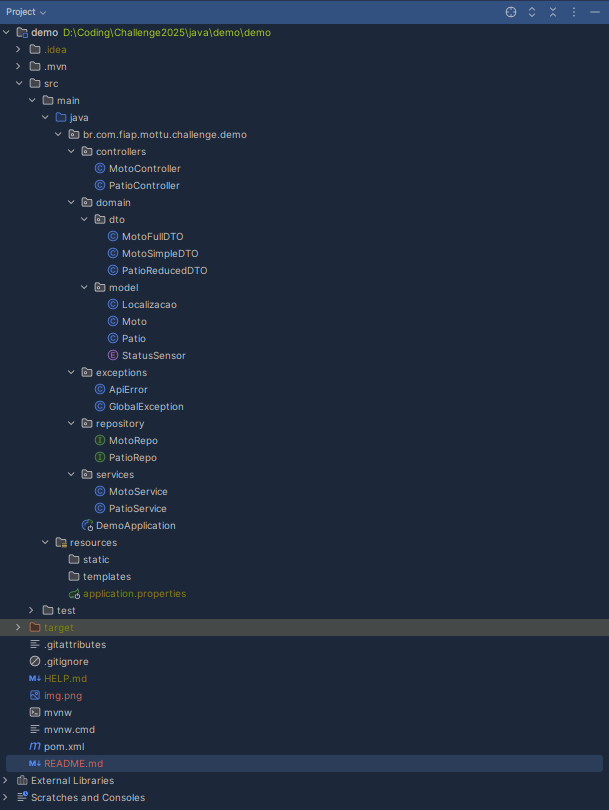

<h1 align="center">Mottu Moto DevOps</h1>

## Autores

👤 **Samuel Yariwake** - RM5556461
👤 **Luiz Felipe** - RM5555591
👤 **Gabriel Lemos** - RM554819
<hr>
Esse projeto contém uma API RESTful desenvolvida em Java com o framework Spring Boot, a imagem respectiva a essa API descrita em um Dockerfile e um folder de scripts azure que contém o passo-a-passo para realizar a execução do projeto inteiro começando no portal Azure, indo para testes locais/ conexão ssh e terminando com a remoção do grupo de recursos via azure cli. A API utiliza Spring Data JPA para persistência de dados, Spring Validation para validação de entradas e está integrada a um banco de dados Oracle. Além disso, a documentação interativa da API pode ser acessada via Swagger UI, facilitando a exploração e o uso dos endpoints disponíveis. Este projeto foi desenvolvido como parte de um desafio acadêmico em parceria com a FIAP e a Mottu.
<hr>

## Tecnologias Utilizadas

- **Java 21**
- **Docker**
- **Azure**
- **Spring Boot 3.4.5**
- **Spring Data JPA**
- **Spring Validation**
- **Spring Web**
- **Oracle Database**
- **Maven**

## Configuração do Ambiente

### Pré-requisitos

- Créditos Azure
- Cliente SSH funcional (como OpenSSH, PuTTY, etc.)
- Azure CLI instalado na sua máquina local (opcional, mas útil para gerenciar recursos Azure).

### Executando o Projeto

Siga os passos abaixo para configurar a infraestrutura no Azure OU acesse o folder scripts azure e vá seguindo um por um pela numeração, instalar as dependências na VM, e executar a aplicação Dockerizada.

1.  **Criação da Máquina Virtual no Azure:**
    * Acesse o Azure Cloud Shell no portal do Azure.
    * Crie o script para a VM:
        ```bash
        touch vmlinuxcreate.sh
        nano vmlinuxcreate.sh
        ```
    * Copie o conteúdo abaixo para o arquivo `vmlinuxcreate.sh`:
        ```bash
        #!/bin/bash
        ## Variáveis
        grupox="rg-sll"&&
        locationx="brazilsouth"&&
        vmnamex="sll-vm"&&
        vmtypex="almalinux:almalinux-x86_64:9-gen2:latest"&&
        usuariox="sllcomp"&&
        senhax="sll123@2025SLL@"&&
        
        ## Criação do Grupo de Serviços
        az group create --name $grupox --location $locationx &&
        ## Dados da VM
        echo "Nome da VM:" $vmnamex &&
        echo "Imagem:" $vmtypex &&
        echo "Usuário:" $usuariox &&
        echo "Senha:" $senhax &&
        az vm create --resource-group $grupox --name $vmnamex --image $vmtypex --size Standard_B2s --admin-username $usuariox --admin-password $senhax
        ```
    * Salve o arquivo (Ctrl+O, Enter em `nano`, e depois Ctrl+X para sair).
    * Torne o script executável e execute-o:
        ```bash
        chmod 744 vmlinuxcreate.sh
        ./vmlinuxcreate.sh
        ```
    * Aguarde a VM ser criada.

2.  **Abrir a Porta 8080 na VM:**
    * Ainda no Azure Cloud Shell, crie o script para abrir a porta:
        ```bash
        touch abrePorta.sh
        nano abrePorta.sh
        ```
    * Copie o conteúdo abaixo para o arquivo `abrePorta.sh`:
        ```bash
        #!/bin/bash

        grupox="rg-sll"
        vmnamex="sll-vm"

        porta="8080"
        prioridade=100 # Prioridade padrão para regras de NSG

        az vm open-port --resource-group "$grupox" --name "$vmnamex" --port "$porta" --priority "$prioridade"

        echo "A porta $porta foi aberta com sucesso na VM $vmnamex."
        ```
    * Salve o arquivo e saia do `nano`.
    * Torne o script executável e execute-o:
        ```bash
        chmod 744 abrePorta.sh
        ./abrePorta.sh
        ```

3.  **Obter o Endereço IP Público da VM:**
    * No Azure Cloud Shell, execute o comando:
        ```bash
        echo "Obtendo IP da VM 'sll-vm' no grupo 'rg-sll'..."
        vmip=$(az vm list-ip-addresses --resource-group "rg-sll" --name "sll-vm" --query "[0].virtualMachine.network.publicIpAddresses[0].ipAddress" --output tsv)
        echo "IP público da VM: $vmip"
        ```
    * **Anote o valor de `$vmip`** exibido. Ele será usado para a conexão SSH e para acessar a aplicação.

4.  **Conectar à VM via SSH e Configurar o Ambiente:**
    * Abra um terminal na sua máquina local.
    * Conecte-se à VM usando o IP obtido no passo anterior e o usuário `sllcomp` (senha: `sll123@2025SLL@`):
        ```bash
        ssh sllcomp@SEU_VM_IP # Substitua SEU_VM_IP pelo IP anotado
        ```
    * Uma vez conectado à VM, execute os seguintes comandos para instalar as dependências:
        ```bash
       sudo yum install git -y

      sudo yum install nano -y
      
      sudo rpm --import https://packages.microsoft.com/keys/microsoft.asc
      
      sudo dnf install -y https://packages.microsoft.com/config/rhel/9.0/packages-microsoft-prod.rpm
      
      sudo dnf install azure-cli -y
      
      az --version
      
      sudo yum install -y yum-utils -y
      
      sudo yum-config-manager --add-repo https://download.docker.com/linux/rhel/docker-ce.repo
      
      sudo yum install docker-ce docker-ce-cli containerd.io docker-buildx-plugin docker-compose-plugin -y
      
      sudo systemctl start docker
        ```

5.  **Clonar o Repositório e Executar a Aplicação com Docker:**
    * Ainda na sessão SSH da VM:
        ```bash
        # Clonar o repositório do projeto
        git clone [https://github.com/L3to/Mottu-DevOps-Challange-Sprint1.git](https://github.com/L3to/Mottu-DevOps-Challange-Sprint1.git)

        # Adicionar o usuário atual ao grupo docker para executar comandos docker sem sudo
        sudo usermod -aG docker sllcomp
        ```
    * **Importante:** Saia da sessão SSH e reconecte para que a alteração de grupo do usuário tenha efeito:
        ```bash
        exit
        ```
        E então conecte-se novamente:
        ```bash
        ssh sllcomp@SEU_VM_IP # Substitua SEU_VM_IP pelo IP anotado
        ```
    * Navegue até o diretório do projeto, construa a imagem Docker e execute o container:
        ```bash
        cd Mottu-DevOps-Challange-Sprint1
        docker build -t mottu-image .
        # ATENÇÃO: Substitua o user e password pelas credenciais reais do seu banco de dados Oracle
        docker container run -d -p 8080:8080 -e DB_USERNAME=SEU_USUARIO_ORACLE -e DB_PASSWORD=SUA_SENHA_ORACLE --name mottu-application mottu-image
        ```

6.  **Acessar a Aplicação:**
    * Após o container Docker iniciar com sucesso, a API estará acessível no seu navegador:
        `http://SEU_VM_IP:8080` (substitua `SEU_VM_IP` pelo IP público da sua VM).

7. **Limpeza do Ambiente**

Após concluir os testes e não precisar mais dos recursos, é importante excluí-los para evitar custos desnecessários no Azure.

**Excluir o Grupo de Recursos:**

  - Execute o seguinte comando no Azure Cloud Shell ou no Azure CLI em sua máquina local (se configurado):
  - 
      ```bash
      az group delete --name rg-sll -y
      ```
  - Este comando excluirá todos os recursos dentro do grupo `rg-sll`, incluindo a VM, discos, interface de rede, etc. A opção `-y` confirma a exclusão

## Endpoints

### Pátios

- **GET** `/patios`
  Lista os pátios com filtros opcionais por nome e capacidade máxima.

- **GET** `/patios/{id}`
  Retorna os detalhes de um pátio específico.

- **POST** `/patios`
  Cria um novo pátio.

- **PUT** `/patios/{id}`
  Atualiza os dados de um pátio existente.

- **DELETE** `/patios/{id}`
  Remove um pátio.

### Motos

- **GET** `/motos`
  Lista as motos com filtros opcionais por modelo e status do sensor.

- **GET** `/motos/{id}`
  Retorna os detalhes de uma moto específica.

- **POST** `/motos`
  Cria uma nova moto.

- **PUT** `/motos/{id}`
  Atualiza os dados de uma moto existente.

- **DELETE** `/motos/{id}`
  Remove uma moto.

## Estrutura do Projeto

- `src/main/java/br/com/fiap/mottu/challenge/demo/controllers`
  Contém os controladores REST.

- `src/main/java/br/com/fiap/mottu/challenge/demo/domain`
  Contém os modelos, DTOs e classes relacionadas.

- `src/main/java/br/com/fiap/mottu/challenge/demo/services`
  Contém a lógica de negócios.

- `src/main/java/br/com/fiap/mottu/challenge/demo/repository`
  Contém os repositórios JPA.

- `src/main/resources`
  Contém arquivos de configuração, como `application.properties`.

### Exemplo de **Requisições** (5 inserts)


### Print da remoção


      

